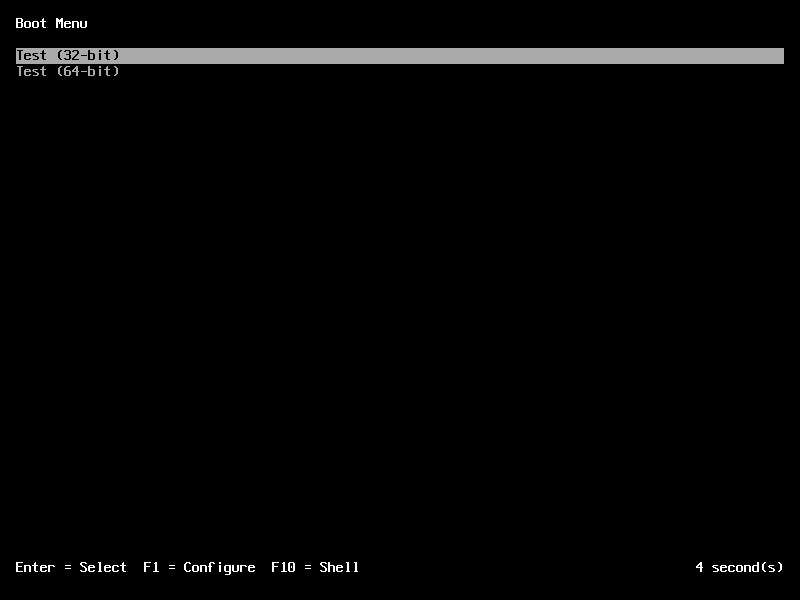
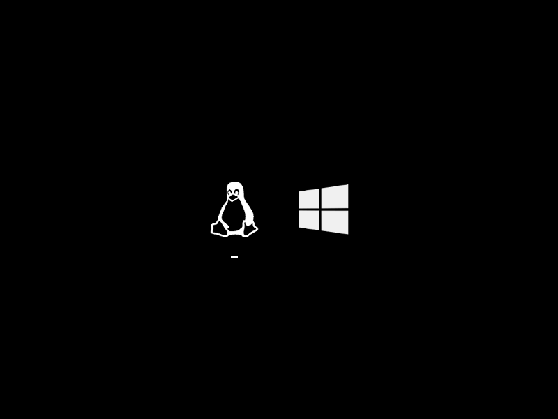

KBoot
=====

KBoot is a general-purpose boot loader, which currently supports both BIOS- and
UEFI-based x86 PCs.

A short feature overview:

 * Text and GUI menu interfaces
 * Interactive shell
 * Serial console support
 * Ext2/3/4, FAT and ISO9660 filesystem support
 * MBR and GPT partition support
 * PXE network booting
 * Linux and
   [Multiboot](https://www.gnu.org/software/grub/manual/multiboot/multiboot.html)
   OS loaders
 * BIOS and EFI chain loaders (for booting OSes not natively supported, e.g.
   Windows)
 * [Custom boot protocol](documentation/kboot-protocol.md) targeting hobby OS
   projects

Current limitations:

 * No FAT boot sector - cannot boot directly from a FAT filesystem on legacy
   BIOS systems.
 * Floppy drives are not supported on BIOS systems.
 * UEFI installation to disk on Macs is not supported (legacy BIOS, i.e. Boot
   Camp, is OK).

Screenshots
-----------

Documentation
-------------

User documentation is available [here](documentation/guide).

Reporting Issues
----------------

Issues can be reported via the GitHub
[issue tracker](https://github.com/aejsmith/kboot/issues).

License
-------

KBoot is licensed under the terms of the [ISC license](documentation/license.md).
