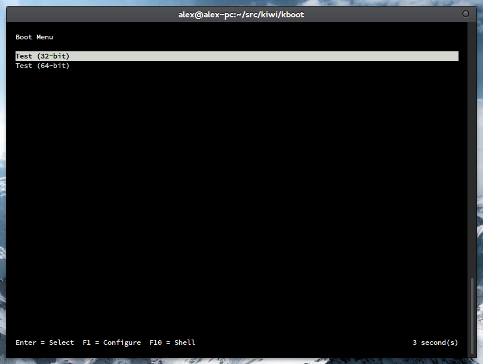

Serial Console
==============

KBoot supports being used over a serial port, including its text UI. In debug
builds, it will additionally output its debug log to the serial port by default
as well.

To set the console to a serial port, use the following command in the
configuration file, replacing N with the index of the port you wish to use (a
list of available ports can be obtained with the `lsconsole` command):

    console "serialN"

The default configuration for a serial port is as follows:

 * **Baud Rate**: 115200
 * **Data Bits**: 8
 * **Parity**: None
 * **Stop Bits**: 1

These can be changed using the `serial` command. See the
[Command Reference](commands.md#serial) for details of exact usage.

Example:

    serial "serial0" 38400 8 "none" 1
    console "serial0"

This gives a serial console UI like the following:

